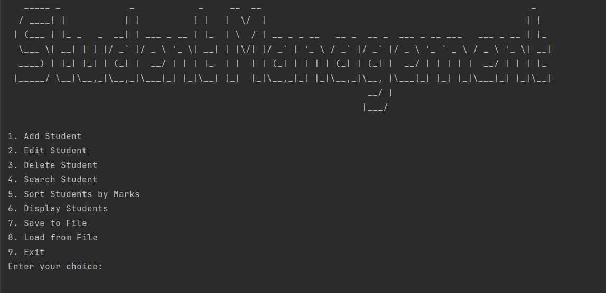

  <pre>  
   _____ _             _            _     __  __                                                   _   
  / ____| |           | |          | |   |  \/  |                                                 | |  
 | (___ | |_ _   _  __| | ___ _ __ | |_  | \  / | __ _ _ __   __ _  __ _  ___ _ __ ___   ___ _ __ | |_ 
  \___ \| __| | | |/ _` |/ _ \ '_ \| __| | |\/| |/ _` | '_ \ / _` |/ _` |/ _ \ '_ ` _ \ / _ \ '_ \| __|
  ____) | |_| |_| | (_| |  __/ | | | |_  | |  | | (_| | | | | (_| | (_| |  __/ | | | | |  __/ | | | |_ 
 |_____/ \__|\__,_|\__,_|\___|_| |_|\__| |_|  |_|\__,_|_| |_|\__,_|\__, |\___|_| |_| |_|\___|_| |_|\__|
                                                                    __/ |                              
                                                                   |___/                               
  </pre>

Student Manager is a Java application that allows users to manage student records. It provides functionalities to add, edit, delete, search, and display student information. The application also supports sorting students by their marks and saving/loading data from a file. This code serves my ASM 1 DSA subject.

## Features

- ➕ Add a new student: Enter the student's ID, name, and marks to add them to the system.
- ✏️ Edit a student: Update the name and marks of an existing student by providing their ID.
- ❌ Delete a student: Remove a student from the system by specifying their ID.
- 🔍 Search for a student: Retrieve details of a student by searching for their ID.
- 📊 Sort students by marks: Arrange the list of students in descending order based on their marks.
- 📋Display students: View a formatted table displaying all the stored student records.
- 💾 Save to file: Export the student data to a CSV file for future reference.
- 📥 Load from file: Import student data from a CSV file to populate the system.
